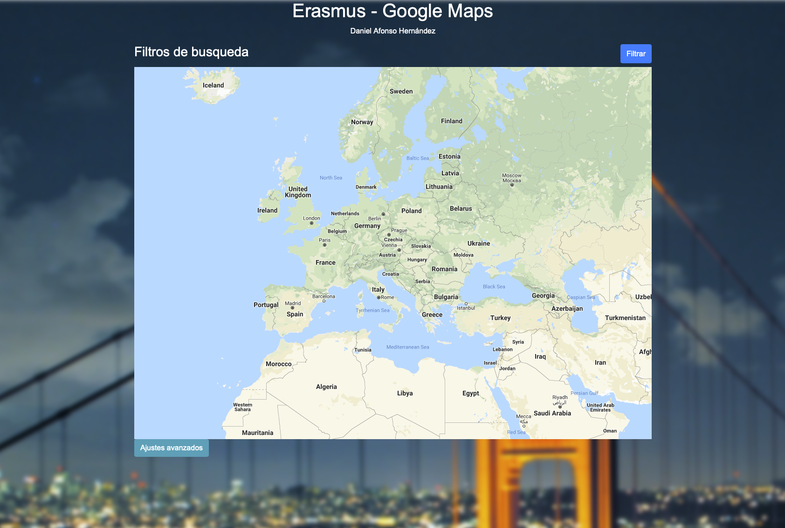

### ErasmusMaps 🚀
_Esta app es un buscador de localizaciones, muestra donde han ido los alumnos de erasmus estos últimos años en un mapa de google interactivo._

### Enlace 🔧
# https://daniafonso.github.io/erasmusMaps/

## Previsualización

  

